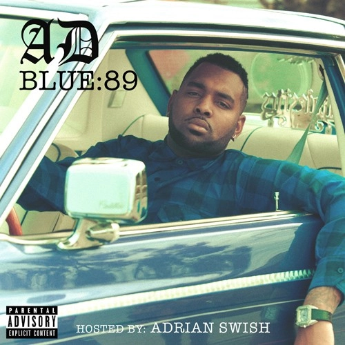
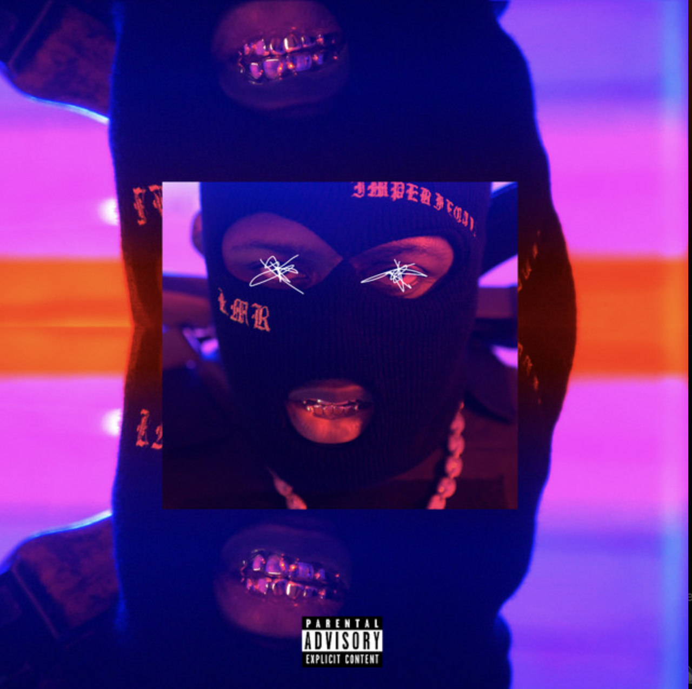
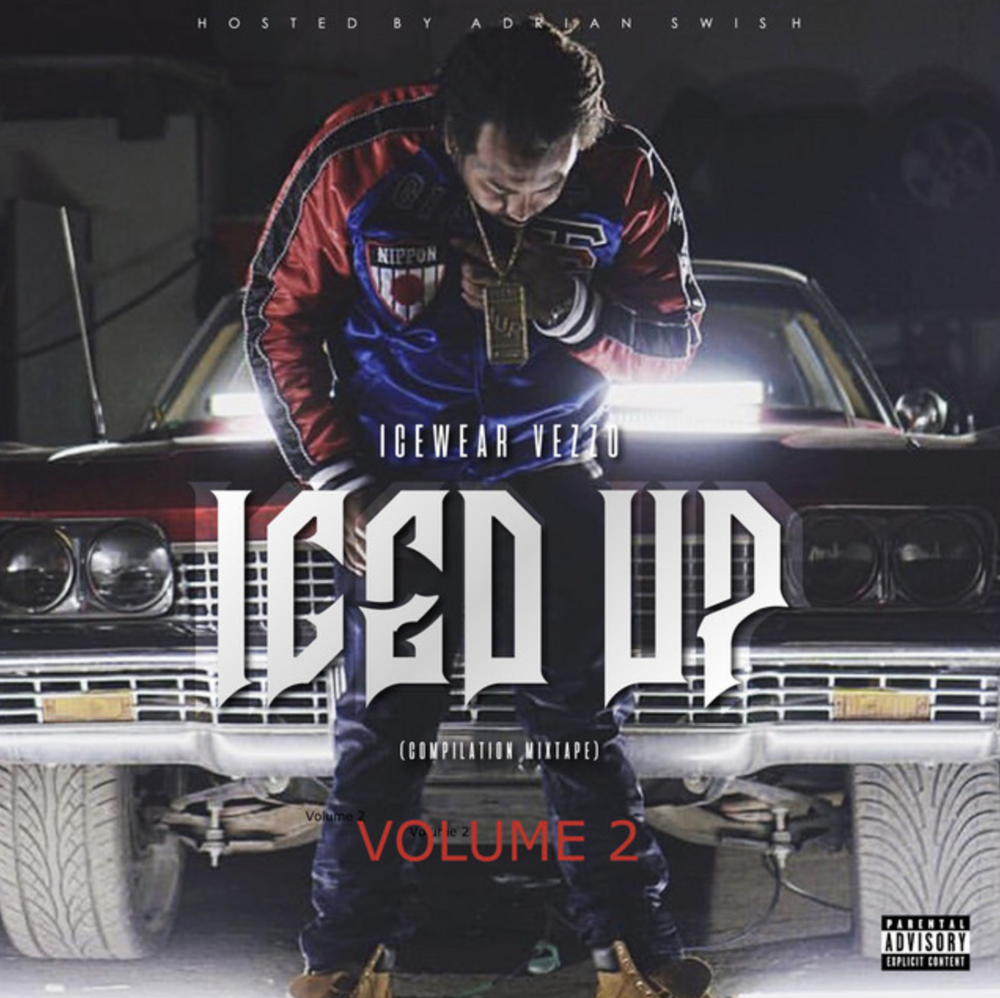
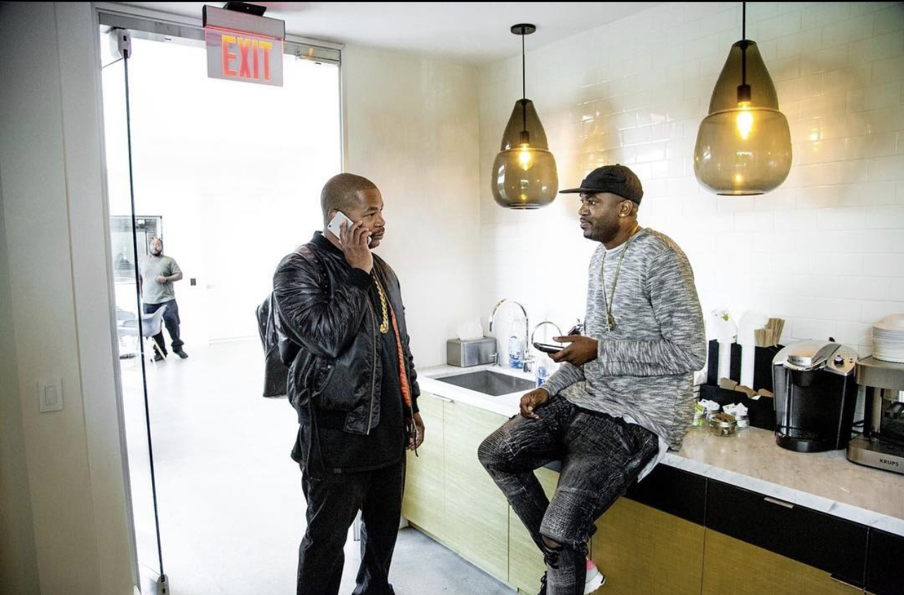
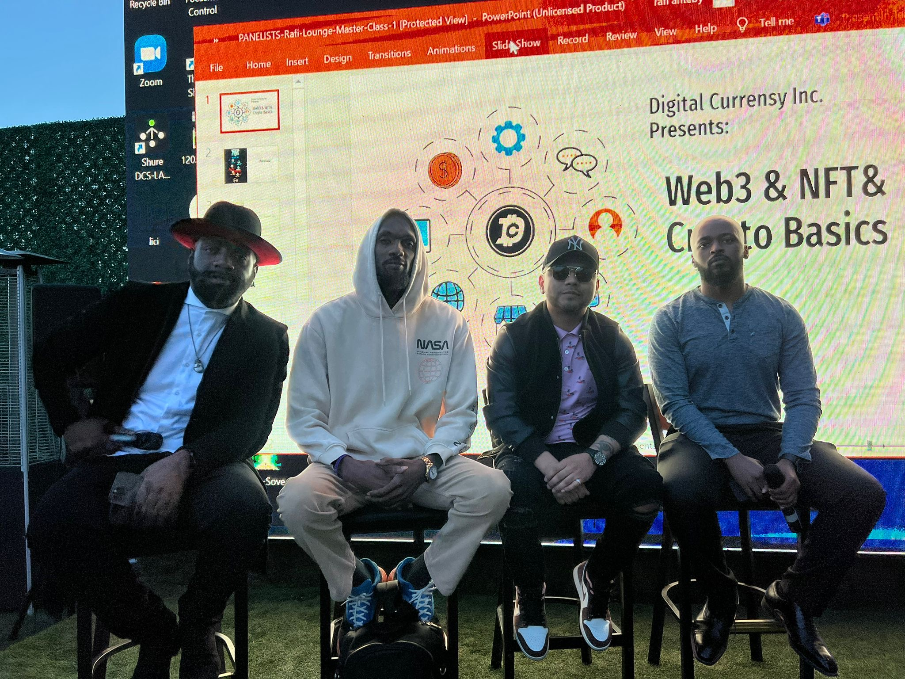

<p align="center">
  
</p>

<h1 align="center">Adrian Swish</h1>

<p align="center"><strong>Founder hub for music, AI, sports tech, and Digital Currensy Inc.</strong></p>

<p align="center">
  Official personal site for Adrian Swish — founder of Digital Currensy Inc. and Label IQ AI.<br>
  Book a call, walk the vault, open the AI suite, or go to the company platform.
</p>

<p align="center">
  <a href="https://adrian-swish-site.vercel.app"><strong>Live site</strong></a>
  &nbsp;·&nbsp;
  <a href="https://adrianswish.book.kiwilaunch.com/">Book a call</a>
  &nbsp;·&nbsp;
  <a href="https://www.digitalcurrensy.com">Digital Currensy</a>
  &nbsp;·&nbsp;
  <a href="https://app.labeliq.ai">Label IQ AI</a>
</p>

<p align="center">
  <a href="HOW_TO_USE.md">How to use</a>
  &nbsp;·&nbsp;
  <a href="docs/ARCHITECTURE.md">Architecture</a>
  &nbsp;·&nbsp;
  <a href="CONTRIBUTING.md">Contributing</a>
</p>

---

## What this site is for

This is Adrian’s public headquarters. Not a starter template. Not the company distribution app.

A visitor uses it to:

1. See who Adrian is and what he has built
2. Open the work — mixtapes, campaigns, AI tools, games, NFTs, press
3. Book a strategy call or email him
4. Jump to the live companies (Digital Currensy, Label IQ AI, The U Basketball Prep)

**In one sentence:** open the live site, scroll the systems, book the call if you want to work together.

Company distribution, 80/20 splits, and artist intake live on [digitalcurrensy.com](https://www.digitalcurrensy.com). This repo is the founder site only.

---

## Watch how to use it

The live site is the walkthrough. Open it, then follow the steps in [HOW_TO_USE.md](HOW_TO_USE.md).

[](https://www.youtube.com/watch?v=T4005q3Xi4I)

| Watch | Link |
| --- | --- |
| Site walkthrough (text) | [HOW_TO_USE.md](HOW_TO_USE.md) |
| Company overview | [youtube.com/watch?v=T4005q3Xi4I](https://www.youtube.com/watch?v=T4005q3Xi4I) |
| Label IQ AI | [youtube.com/watch?v=pLtealaMUD8](https://www.youtube.com/watch?v=pLtealaMUD8) |
| Interview | [UNRESTRICTED INTERVIEW: ADRIAN SWISH](https://www.youtube.com/watch?v=f2mZS0D1xVc) |

Channel: [youtube.com/@DigitalCurrensy](https://www.youtube.com/@DigitalCurrensy)

---

## Platform screenshots

### Founder site and AI product

<p>
  
  
</p>

Label IQ AI is the live product grid (search, create, cap). NFT NYC is the stages and signals record.

### Vault and campaigns

<p>
  
  
  
</p>

Campaign work in the vault includes RMR *Rascal* (Rolling Stone), Icewear Vezzo *Iced Up*, Kid Ink, Peezy, Vory, Prince Chrishan, and Comptonfornia.

### Sports and community

<p>
  
  
</p>

---

## How a visitor uses the platform

Full walkthrough: **[HOW_TO_USE.md](HOW_TO_USE.md)**

1. Open [adrian-swish-site.vercel.app](https://adrian-swish-site.vercel.app).
2. Use the command nav: Home, AI, Shop, Games, Contact — or scroll Systems 00–14.
3. Open a holding when you want the live product: [digitalcurrensy.com](https://www.digitalcurrensy.com) or [app.labeliq.ai](https://app.labeliq.ai).
4. Book a call at [adrianswish.book.kiwilaunch.com](https://adrianswish.book.kiwilaunch.com/).
5. Or email [swish@digitalcurrensy.com](mailto:swish@digitalcurrensy.com). Press: subject line `PRESS`.

| You click | What it does |
| --- | --- |
| **Book a Call** | Opens the KiwiLaunch booking page |
| **AI** | Jumps to the AI Command Stack |
| **Shop** | Digital products, playbooks, workflows |
| **Games** | Arcade of original Remix games |
| **Contact** | Email + intake |
| **Digital Currensy / Label IQ links** | Leaves this site for the live company products |

---

## What is on the site

| System | Section | What you get |
| --- | --- | --- |
| 00 | The Network | How the verticals connect |
| 01 | Origin Protocol | Background and operating thesis |
| 02 | Strategic Services | Who Adrian works with |
| 03 | AI Command Stack | Music, marketing, legal, sports, creator tools |
| 04 | Strategic Holdings | DCI · Label IQ AI · The U Prep · Sixth Man VR |
| 05 | The Vault | 21 mixtape / campaign projects |
| 06 | Media Universe | Books, whitepaper, publications |
| 07 | Game Arcade | 11 original games |
| 08 | Shop | Digital products and merch |
| 09 | Chrome Ledger | NFT / collectible gallery |
| 10 | Impact Ledger | Philanthropy record |
| 11 | Stages & Signals | Panels and talks |
| 12 | Press Room | Coverage |
| 13 | The Swish Signal | Newsletter |
| 14 | Executive Intake | Booking and contact |

Holdings at a glance:

| Company | Role | URL |
| --- | --- | --- |
| Digital Currensy Inc. | Founder · active | [digitalcurrensy.com](https://www.digitalcurrensy.com) |
| Label IQ AI | Founder · live app | [app.labeliq.ai](https://app.labeliq.ai) |
| The U Basketball Prep Academy | Partner · active | Instagram `@theubasketballprepacdemy` |
| The Sixth Man App | Builder · coming soon | Request access via contact |

---

## What this repository is

This repo is a **Next.js 16 shell** around one production HTML document. Every App Router URL loads that same document in a fullscreen iframe so pretty links do not 404.

| Surface | URL | Role |
| --- | --- | --- |
| Live site | [adrian-swish-site.vercel.app](https://adrian-swish-site.vercel.app) | Vercel production |
| Exact HTML | `/exact/adrian-swish-website-code.html` | The real page |
| Company site | [digitalcurrensy.com](https://www.digitalcurrensy.com) | Separate repo: `DigitalCurrensy/dci-website` |
| Label IQ AI | [app.labeliq.ai](https://app.labeliq.ai) | Separate product |
| Book a call | [adrianswish.book.kiwilaunch.com](https://adrianswish.book.kiwilaunch.com/) | Not in this repo |

This repo is **not** a CMS, **not** an API, and **not** a database app. Vault, gallery, shop, and games are static sections inside the HTML file.

File map and rewrite plan: **[docs/ARCHITECTURE.md](docs/ARCHITECTURE.md)**

---

## Data and storage

There is no application database in this repository.

| Feature on the site | Where the data lives | Live? |
| --- | --- | --- |
| Origin / bio | Hardcoded HTML | Static |
| AI Command Stack | Hardcoded HTML + outbound links | Static page, live product at app.labeliq.ai |
| Holdings | Hardcoded cards + external URLs | Static |
| Mixtape Vault | Images in `public/exact/` + HTML copy | Static |
| NFT Gallery | Static images | Static — not an on-chain indexer |
| Shop / Arcade | Static HTML + Remix game links | Static |
| Book a call | KiwiLaunch | Live, not in this repo |

---

## Run it locally

Node 20+ and [pnpm](https://pnpm.io).

```bash
git clone https://github.com/DigitalCurrensy/adrian-swish-site.git
cd adrian-swish-site
pnpm install
pnpm dev
```

Open [http://localhost:3000](http://localhost:3000).

| Script | What it does |
| --- | --- |
| `pnpm dev` | Local server |
| `pnpm build` | Production build |
| `pnpm start` | Serve the build |
| `pnpm lint` | ESLint |

No `.env` file. No database URL. No API keys.

To change what visitors see, edit `public/exact/adrian-swish-website-code.html`. To change the wrapper or the browser tab title, edit `components/site/ExactHtmlFrame.tsx` and `app/layout.tsx`.

---

## Related repos

- [dci-website](https://github.com/DigitalCurrensy/dci-website) — Digital Currensy Inc. public site
- [first-bucket-studios](https://github.com/DigitalCurrensy/first-bucket-studios) — basketball pack opener
- [ICEWEAR-VEZZO-ROP4-WEBSITE](https://github.com/DigitalCurrensy/ICEWEAR-VEZZO-ROP4-WEBSITE) — richoffpints.com

---

## Contact

- Site: [adrian-swish-site.vercel.app](https://adrian-swish-site.vercel.app)
- Email: [swish@digitalcurrensy.com](mailto:swish@digitalcurrensy.com)
- Booking: [adrianswish.book.kiwilaunch.com](https://adrianswish.book.kiwilaunch.com/)
- Instagram: [@iamadrianswish](https://instagram.com/iamadrianswish)
- X: [@IAmAdrianSwish](https://x.com/IAmAdrianSwish)
- LinkedIn: [/in/adrianswish](https://www.linkedin.com/in/adrianswish/)

© 2026 Adrian Swish / Digital Currensy Inc.
